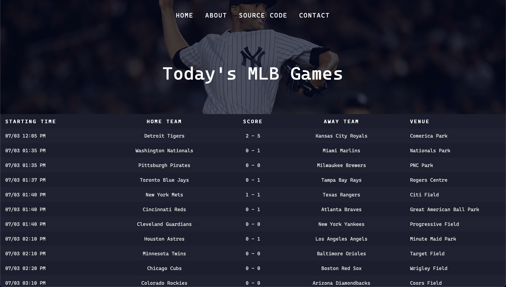

# MLB Tracker



This project fetches the current day's MLB game data from a json format using the MLB API, and displays it on a webpage!

Using python as the backend, the data is converted into a list of dictionaries, which is then sorted into its corresponding Game and Team modules.

This data is displayed in table format on a webpage with the help of [Flask](https://pypi.org/project/Flask/), which allows python variables to be passed into html files using the [Jinja2](https://pypi.org/project/Jinja2/) template engine.

## Technologies Used for This Project

**Languages**

-   [Python](https://www.python.org)
-   [HTML](https://html.spec.whatwg.org)
-   [CSS](https://www.w3.org/Style/CSS/Overview.en.html)

**External Python Modules**

-   [Flask](https://pypi.org/project/Flask/)
-   [Jinja2](https://pypi.org/project/Jinja2/)
-   [pytz](https://pypi.org/project/pytz/)
-   [requests](https://pypi.org/project/requests/)

**MLB Current Day Game Schedule API**

-   http://statsapi.mlb.com/api/v1/schedule/games/?sportId=1

## Run your own instance of this website

**Requirements**:

-   [Python3](https://www.python.org/download/releases/3.0/) is installed
-   [Pip](https://pypi.org/project/pip/) is installed

**Installation**
In order to run your own instance of this website, enter in the following commands:

```console
git clone https://github.com/ahs718/MLB-Tracker.git
cd MLB-Tracker
```

```console
python3 -m venv venv
source venv/bin/activate
pip install -r requirements.txt
```

```console
cd website && python3 main.py
```

-   After entering the following commands, you should now have a development server set up!
-   Go to the following url in your web browser to view the site: http://127.0.0.1:5000
